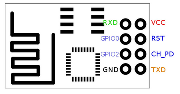
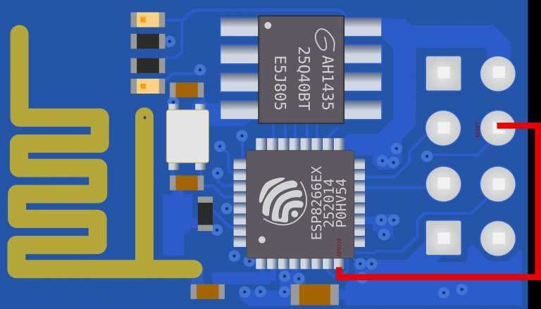

# ESP8266 Deep Sleep

Es ist soweit! Die ersten Projekte mit dem ESP werden langsam langweilig… Als nächstes ist Deep-Sleep dran! Ich nämlich brauche ein möglichst stromsparenden Betrieb, da mein Projekt später mit einer Batterie laufen soll - und das möglichst lange.

Der Betrieb mit einer Deep-Sleep-Funktion eignet sich dafür bestens.


## Was ist Deep-Sleep?

Deep-Sleep ist ein Zustand des Boards, welches einen sehr geringen Stromverbraucht misst. Grund dafür ist, dass so gut wie alle Funktionen des Boards außer Betrieb sind.

Besser gesagt: Alle Funktionen bis auf *RTC*.

Hier mal eine Übersicht, welche Funktionen von Deep-Sleep betroffen sind:

|   Funktion   | Zustand |
| :----------: | :-----: |
|     WLAN     |   aus   |
| System clock |   aus   |
|     CPU      |   aus   |
|     RTC      |   an    |

Laut verschiedenen Angaben im Netz beträgt der **Stromverbrauch während dem Deep-Sleep zwischen 10 und 20 uA**. Das entspricht 0,01 - 0,02 mA. Das ist der Wahnsinn!

Ob 10uA oder 20 uA, … mit Deep-Sleep kann der ESP, je nach Aufgabe, monatelang mit einer einzigen Batterie betrieben werden.

## Wie wird der ESP wieder aufgeweckt?

Zum Aufwecken des ESPs sind mir zwei Möglichkeiten bekannt:

####  **1. Aufwecken per Knopfdruck**

Eine Möglichkeit den ESP aus dem Schlaf zu holen, ist der Knopfdruck.

Hierbei gibt es keine Zeitbeschränkung. Das Aufwecken per Knopfdruck könnte zum Beispiel für Fernbedienungen jeglicher Art verwendet werden.

####  **2. Automatisch nach Ablauf einer bestimmten Zeit**

Der ESP kann auch für eine bestimmte Zeit in den Deep-Sleep versetzt werden.

Die **maximal mögliche Dauer beträgt hierbei 71 Minuten**. Diese Methode eignet sich unter anderem für Sensoren, die regelmäßig einen Wert liefern oder abfragen sollen.

# Tutorial

### 1. DEEP-SLEEP MIT KNOPFDRUCK

Um den ESP auf unbestimmte Zeit in den Deep-Sleep zu schicken, wird lediglich eine Zeile Code benötigt.

```c++
ESP.deepSleep(0);
```

In einem Programm könnte das so aussehen:

```c++
void setup() {
  pinMode(LED_BUILTIN, OUTPUT);  
}

void loop() {
  digitalWrite(LED_BUILTIN, LOW);
  delay(5000);

  ESP.deepSleep(0);

}
```

Sobald der ESP mit Strom versorgt wird, leuchtet die blaue LED für 5 Sekunden.

Nach Ablauf des `delay(5000);` schicken wir den ESP auf unbestimmte Dauer in den Deep-Sleep-Modus.

Zum Aufwecken muss der Pin `RST` kurz mit `GND` verbunden werden.



Sobald `RST` nicht mehr mit `GND` verbunden ist, startet der ESP und führt den gespeicherten Programmcode aus.

Die Zeile `ESP.deepSleep();` schickt den ESP anschließend wieder schlafen, bis wir ihn erneut aufwecken.

Fertig ist der ESP, der auf Knopfdruck startet, das Programm ausführt, und danach wieder pennen geht. :+1:

###  2. DEEP-SLEEP MIT ZEIT

Um den ESP auf bestimmte Zeit in den Deep-Sleep zu schicken, wird die selbe Zeile Code benötigt. Diesmal aber mit Zeitangabe. Die Angabe der Zeit erfolgt in uS.

```c++
ESP.deepSleep(5000000);
```

Diese Zeile schickt den ESP für 5 Sekunden in den Deep-Sleep. In der Funktion können auch mathematische Bezeichnungen verwendet werden. Folgende Zeile schickt den ESP ebenfalls für 5 Sekunden in den Deep-Sleep.

```c++
ESP.deepSleep(5e6);
void setup() {
  pinMode(LED_BUILTIN, OUTPUT);  
}

void loop() {
  digitalWrite(LED_BUILTIN, LOW);
  delay(5000);

  ESP.deepSleep(5e6);

}
```

Auch hier gilt: Der ESP führt das Programm aus, und wird anschließend in den Deep-Sleep geschickt. Diesmal aber nur für 5 Sekunden.

Leider geht das Aufwecken nach den 5 Sekunden nicht ohne Weiteres …

… damit sich der ESP nach Ablauf der 5 Sekunden selbst wecken kann, muss eine dauerhafte Verbindung zwischen `RST` und `GPIO16` hergestellt werden.

Erst diese Verbindung automatisiert den Vorgang des Weckens.

**… obacht - jetzt wird’s fummlig:**



Sobald die Verbindung steht, haben wir einen ESP, der das gespeicherte Programm ausführt, und sich anschließend selbst in den Deep-Sleep Modus versetzt… bis er sich nach 5 Sekunden wieder weckt und das Programm erneut ausführt. …

… endless Story bro.

####  Übrigens:

Der ESP kann auch bei der letzteren Methode jederzeit durch die Verbindung von `RST` und `GND` manuell oder per Knopfdruck aufgeweckt werden.

------

###  WIE LANGE HÄLT DIE BATTERIE?

Und jetzt die eigentlich wichtige Frage:

> Ich fänd ein Beispiel mit einer Batterie gut , also quasi eine Rechnung , wir lange das ganze halten würde.
>
> – [@Nick](https://web.archive.org/web/20211018035154/https://my.makesmart.net/uid/10)

Da ich nicht die Möglichkeit habe, den genauen Stromverbrauch zu ermitteln, und ich ungern *bewusst* mit Halbwissen um mich werfe: hier mal eine Seite um den Wert für jegliche Konstellation *theoretisch* zu berechnen: [Berechne mich](https://web.archive.org/web/20211018035154/https://www.akkuline.de/akku-rechner/akku-betriebszeit-rechner) 


